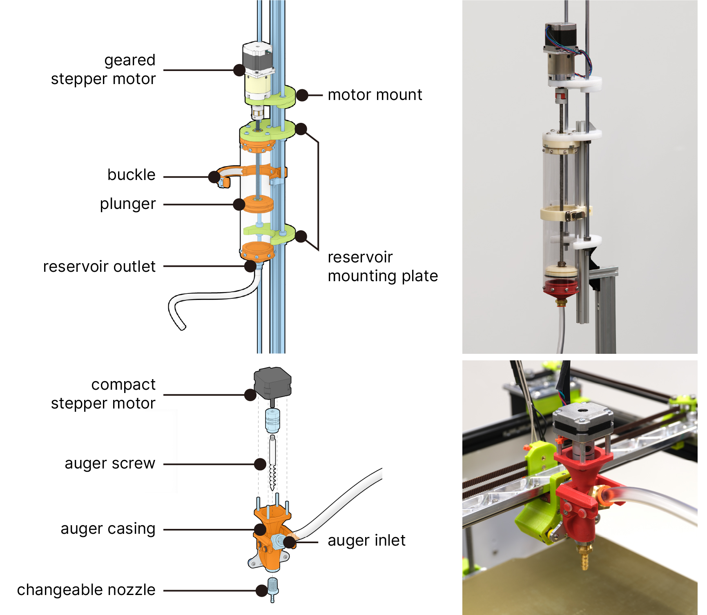

# Dubilee + Fungibot

Dubilee is a [Jubilee](https://jubilee3d.com/index.php?title=Main_Page), an open-source, extensible multi-tool motion platform capable of running GCode for non-loadbearing automation applications, maintained by Machine Agent Danli. This repo contains the firmware and experimental modification that Danli makes for multi-tool experimentation.

Fungibot is a custom extrusion end-effector for biopaste. It has been used to 3D print a mixture of coffee ground, mushroom spawns, and additives.

## Fungibot overview

Fungibot comprises two main subsystems: the material reservoir and the printhead. The CAD files are attached in [CADs](./CADs). Fabrication settings and assembly instruction will be available soon!

### Fungibot hardware

BOM

Milling

3D printing

Assembly

### Fungibot software

Dubilee firmware

Z calibration

### Operation protocol

Dual motor

Mixing ratio

Purge